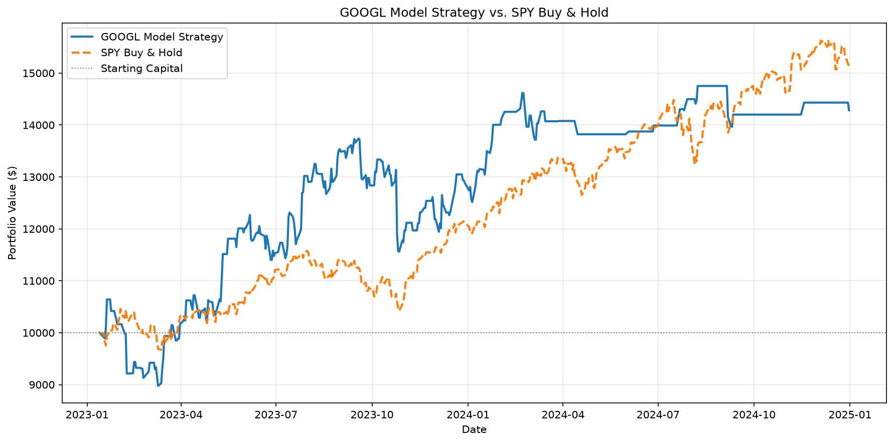

# Stock Price Movement Predictor 📈

An end-to-end machine learning pipeline that predicts **whether a stock will go UP or DOWN the next trading day** — framed as a binary classification problem, not a price-prediction problem (which is far more tractable and honest).

Built to practice time-series feature engineering, XGBoost classification, and deploying ML models as serverless REST APIs on AWS.

**Live API:**
```
POST https://<your-api-gateway-url>/prod/predict
{ "ticker": "AAPL" }
```

---

## Why Classification, Not Regression?

Predicting exact stock prices is notoriously unreliable. Predicting *direction* (up or down) is a more tractable problem: it transforms an unbounded regression target into a binary label, and the question "will this go up tomorrow?" maps cleanly to real trading decisions.

---

## Architecture

```
Yahoo Finance API
      │
      ▼
data_pipeline.py        ← Feature engineering + S3 upload
      │
      ▼
  Amazon S3             ← Stores raw features CSV + trained model
      │
      ▼
train_model.py          ← XGBoost, time-aware split, evaluation artifacts
      │
      ▼
  Amazon S3             ← Stores serialised model (.joblib)
      │
      ▼
lambda_function.py      ← Loads model, fetches latest data, returns prediction
      │
      ▼
API Gateway             ← Live REST endpoint
```

**AWS Services:** S3, IAM, Lambda, API Gateway, CloudWatch

---

## Features Engineered

All features are computed from raw OHLCV (Open, High, Low, Close, Volume) data:

| Feature | Description |
|---|---|
| `sma_5/10/20/50` | Simple moving averages — trend direction |
| `ema_5/10/20/50` | Exponential moving averages — recent-weighted trend |
| `price_to_sma20/50` | Close price relative to MA — momentum signal |
| `rsi_14` | Relative Strength Index — overbought/oversold |
| `macd`, `macd_signal`, `macd_hist` | MACD — trend/momentum crossover |
| `bb_width`, `bb_position` | Bollinger Bands — volatility + price position |
| `volume_ratio` | Volume vs. 20-day average — conviction behind moves |
| `daily_return` | Today's percentage return |
| `return_lag_1..5` | Returns from the previous 5 trading days |
| `volatility_10` | 10-day rolling standard deviation of returns |
| `vix_close` | CBOE Volatility Index close — market-wide "fear gauge" |
| `spy_return` | S&P 500 (SPY) daily return — broad market direction/context |

**Target:** `1` if next day's close > today's close, else `0`

---

## Key Design Decision: Time-Aware Train/Test Split

Stock data is sequential. Randomly shuffling before splitting would allow the model to "see the future" during training — a form of data leakage that inflates test accuracy but fails in production.

```
────────────────────────────────────────────────────────
  2015              TRAIN (80%)              2023 │ TEST (20%) │ 2025
────────────────────────────────────────────────────────
```

The model is always trained on the **past** and evaluated on the **future**.

---

## Model: XGBoost Classifier

XGBoost was chosen over alternatives (LSTM, logistic regression) because:
- Handles tabular time-series data with engineered features better than recurrent networks out of the box
- Produces interpretable feature importances — critical for understanding *why* a prediction was made
- Fast to train and tune; no GPU required
- Strong industry adoption in quantitative finance

**Hyperparameters:** 300 estimators, max depth 4, learning rate 0.05, subsample 0.8

---

## Results (Test Set, 2015–2025)

After all four rounds of improvement (oversampling, VIX/SPY features, threshold tuning), actual test-set performance across all 5 tickers:

| Ticker | Accuracy | UP Recall |
|---|---|---|
| AAPL | 44% | 7% |
| MSFT | 50% | 21% |
| GOOGL | 48% | 44% |
| AMZN | 49% | 54% |
| NVDA | 45% | 5% |

> **Note:** A naive "always predict UP" baseline lands around ~53% accuracy (markets go up more than they go down long-term) — none of these tickers beat it. AMZN and GOOGL showed the strongest signal, with UP recall in a more usable 44–54% range. AAPL and NVDA are the weakest: NVDA's 2023–2024 AI-driven rally was such a sustained, structurally-different regime that historical technical patterns from earlier years no longer transferred, and AAPL similarly struggled to find real signal in this window. These numbers are a reminder that the earlier "Model Development Journey" fixes addressed real bugs (the always-predict-DOWN behavior, the miscalibrated threshold) without guaranteeing genuine predictive edge — imbalance and threshold fixes make a model's predictions *sane*, not necessarily *accurate*.

---

## Walk-Forward Validation

A single 80/20 train/test split only shows performance on one slice of history. To check whether that performance holds up across different market conditions, `train_model.py` also supports **walk-forward validation**: train on a rolling 3-year window, test on the following 6 months, then step forward 6 months and repeat — from 2018 through 2025.

```bash
python train_model.py --ticker AAPL --bucket your-bucket-name --walkforward
```

Results are printed as a summary table and saved to `s3://your-bucket-name/stock-predictor/{ticker}_walkforward.csv`.

### Results (AAPL, 8 windows, 2018–2025)

| Window | Train Period | Test Period | Threshold | Accuracy | Precision | Recall | F1 |
|---|---|---|---|---|---|---|---|
| 1 | 2018-01 → 2021-01 | 2021-01 → 2021-07 | 0.50 | 48.4% | 48.4% | 23.8% | 0.319 |
| 2 | 2018-07 → 2021-07 | 2021-07 → 2022-01 | 0.50 | 51.6% | 72.7% | 22.2% | 0.340 |
| 3 | 2019-01 → 2022-01 | 2022-01 → 2022-07 | 0.50 | 48.4% | 43.5% | 34.5% | 0.385 |
| 4 | 2019-07 → 2022-07 | 2022-07 → 2023-01 | 0.50 | 50.4% | 46.6% | 45.8% | 0.462 |
| 5 | 2020-01 → 2023-01 | 2023-01 → 2023-07 | 0.45 | 48.4% | 55.6% | 49.3% | 0.522 |
| 6 | 2020-07 → 2023-07 | 2023-07 → 2024-01 | 0.50 | 50.8% | 54.8% | 58.0% | 0.563 |
| 7 | 2021-01 → 2024-01 | 2024-01 → 2024-07 | 0.50 | 46.0% | 48.0% | 56.3% | 0.518 |
| 8 | 2021-07 → 2024-07 | 2024-07 → 2025-01 | 0.50 | 39.1% | 50.0% | 1.3% | 0.025 |
| **Average** | | | | **47.9%** | **52.4%** | **36.4%** | **0.392** |

> **Key finding — performance is regime-dependent, not stable.** UP recall rises from 23.8% in window 1 to a peak in windows 5–7 (Jan 2023–Jul 2024), where it holds in the 49–58% range — the model's strongest, most usable stretch. Window 8 (Jul–Dec 2024) then collapses to near-zero recall (1.3%), missing almost every actual up day in that period despite accuracy only dropping to 39%. That combination — recall falling off a cliff while accuracy stays in a plausible range — is a signature of the model reverting to predicting the majority class once the market regime it was trained on stops matching the test period.
>
> The broadly steady 1→6 climb also suggests **recent training data carries more signal than older data**: each window's 3-year train set slides forward in time, and performance improves as older, less-relevant history rolls out of it. That motivates trying a **shorter training window** (e.g. 1–2 years instead of 3) in a future iteration — dropping stale data faster may help the model adapt to regime shifts like the one that broke window 8, instead of diluting recent patterns with years-old ones.

### Cross-Ticker Comparison (All 5 Tickers, 8 Windows Each)

Running the same walk-forward validation on all 5 tickers shows how much AAPL's numbers generalize:

| Ticker | Avg Accuracy | Avg Precision | Avg Recall | Avg F1 | Window 8 UP Recall |
|---|---|---|---|---|---|
| AAPL | 47.9% | 52.4% | 36.4% | 0.392 | 1.3% |
| MSFT | 50.0% | 52.0% | 49.8% | 0.487 | 66.2% |
| GOOGL | 51.2% | 59.9% | 53.7% | 0.509 | 51.4% |
| AMZN | 47.8% | 50.4% | 44.7% | 0.420 | 17.9% |
| NVDA | 49.4% | 56.0% | 45.8% | 0.454 | 77.3% |

> **Key finding — the window 8 collapse is stock-specific to AAPL, not a market-wide regime shift.** If Jul–Dec 2024 had broken the model for every ticker, that would point to a broad macro shock the model couldn't handle. Instead, only AAPL's UP recall collapsed to near-zero (1.3%) in window 8 — MSFT (66.2%), GOOGL (51.4%), and NVDA (77.3%) all saw window-8 recall *above* their own averages, and AMZN dipped (17.9% vs. a 44.7% average) but nowhere near AAPL's near-total miss. That rules out "the whole market changed regime" as the explanation and points instead to something AAPL-specific in that stretch — consistent with the earlier note in [Results](#results-test-set-20152025) that AAPL's technical indicators struggled to find signal in this window even in the single-split evaluation.

---

## Backtesting

Walk-forward validation shows the model's predictive edge is modest and regime-dependent — the next question is whether that edge is worth anything in dollar terms. `backtest.py` simulates a simple trading strategy on each ticker's existing test period (Jan 2023–Dec 2024): starting with $10,000, hold the stock from close to close whenever the model predicts UP, sit in cash whenever it predicts DOWN, and compare the result against a SPY buy-and-hold benchmark starting with the same $10,000.

```bash
python backtest.py --ticker AAPL --bucket your-bucket-name
```

### Results (Jan 2023 – Dec 2024)



| Ticker | Model Strategy Return | Final Value | Gap vs. SPY |
|---|---|---|---|
| AAPL | -0.27% | $9,972.61 | -51.5 pts |
| MSFT | +30.07% | $13,007.24 | -21.2 pts |
| GOOGL | +42.85% | $14,284.68 | -8.4 pts |
| AMZN | +28.11% | $12,810.82 | -23.1 pts |
| NVDA | +32.49% | $13,249.32 | -18.7 pts |
| **SPY Buy & Hold** | **+51.22%** | **$15,122.20** | — |

> **Key finding — four of five strategies were profitable, but none beat SPY.** MSFT, GOOGL, AMZN, and NVDA all ended the two-year period with real gains (+28% to +43%); AAPL was the outlier, finishing essentially flat with a small loss (-0.27%), consistent with its weak walk-forward and single-split results elsewhere in this README. GOOGL came closest to the benchmark, trailing SPY by only 8.4 percentage points — still a meaningful gap, but the smallest of the five, which is why its chart is shown above.
>
> This isn't surprising given the model's ~44–52% test-set accuracy reported earlier: Jan 2023–Dec 2024 was a strong, sustained bull market (SPY +51% in two years), and beating buy-and-hold through a rally like that is an extremely high bar — professional active managers routinely fail to clear it too. A more revealing test of whether this model earns its keep would be **risk-adjusted returns** (Sharpe ratio, max drawdown) rather than raw returns, and/or performance during **bear or sideways markets**, where a model that can rotate to cash on predicted-DOWN days has more room to add value over a benchmark that can only fall with the market. That's a natural next analysis rather than something this backtest currently measures.

---

## Model Development Journey

The model went through several rounds of debugging and iteration after the initial baseline underperformed badly on recent data:

1. **Baseline XGBoost — ~44% accuracy.** The first version, trained on technical indicators alone, barely beat a coin flip and was worse than the "always predict UP" naive baseline. Digging into the confusion matrix showed the model was defaulting to DOWN almost every time — UP recall was only ~9%.

2. **Class balancing (oversampling).** The label distribution is mildly imbalanced (~53% UP / 47% DOWN), but that alone didn't explain a model that predicted DOWN 90%+ of the time. `scale_pos_weight` was tried first and didn't move the needle enough, so the approach switched to `RandomOverSampler` (imbalanced-learn), duplicating minority-class rows in the *train* split only (never the test split, to avoid leaking duplicated test-like rows into evaluation) until it was 50/50. Model capacity was also reduced (`max_depth=3`, `min_child_weight=5`, fewer estimators) to fight overfitting on the noisier training signal.

3. **Market-context features (VIX + SPY).** Technical indicators derived purely from AAPL's own OHLCV data describe the stock in isolation — they say nothing about the broader market regime. Two features were added: `vix_close` (CBOE Volatility Index — the market's "fear gauge") and `spy_return` (S&P 500 daily return — broad market direction), both merged onto the AAPL date index and forward-filled. The idea: a stock's next-day move is influenced by whether the whole market is risk-on or risk-off, not just its own recent price action.

4. **Decision threshold tuning.** Even with balanced training data, the default 0.5 classification threshold turned out to be a poor cutoff for this problem — it swept in a train-set threshold search (0.30–0.50 in steps of 0.05, maximizing F1) and applied the winning threshold to test-set predictions. This threshold is persisted to the metrics CSV in S3 and read by `lambda_function.py` at inference time, so the live API and the offline evaluation stay consistent.

5. **News sentiment (Finnhub + VADER) — no improvement.** A `sentiment_score` feature was added by pulling daily headlines per ticker from the Finnhub API, scoring each with NLTK's VADER sentiment analyzer, and merging the daily mean compound score onto the feature set (forward-filled, defaulting to 0.0 on days with no news). The hypothesis was that market-wide VIX/SPY features miss stock-specific news events that move a single name independent of the broader market. In practice it **didn't help and hurt one ticker**: AMZN's average UP recall dropped from 54% to 31%, while the other four tickers were essentially unchanged. Three likely reasons:
   - **VADER is tuned for social media, not financial news.** It was built and validated on tweets and short informal text, where sentiment cues (punctuation, capitalization, slang) work differently than in headline-style financial reporting, where "growth slows" and "misses estimates" carry strong negative signal VADER's lexicon isn't tuned to catch.
   - **Finnhub's free tier has sparse historical coverage.** Company-news history is thin the further back you query, so a large fraction of training rows fall back to the neutral 0.0 default rather than a real sentiment signal — diluting whatever signal exists in the days that do have coverage.
   - **Daily aggregation loses intraday timing.** Averaging all of a day's headlines into one score discards *when* during the day a headline landed relative to market open/close, and mixes pre-market catalysts with after-hours noise into a single number.

   This is a **known limitation**, not a bug — the feature is live in the pipeline (`sentiment_score` in `FEATURE_COLS`) but isn't currently pulling its weight. A finance-specific language model like **FinBERT** (pretrained on financial text rather than general/social-media text) is a more promising direction than swapping sentiment sources within the same VADER-based approach.

**Honest caveat:** even after five rounds of improvement, technical indicators — even augmented with VIX/SPY context and news sentiment — have a limited ceiling on 2023–2024 AAPL data. That period included unusually concentrated conditions (the AI/mega-cap rally, a fast Fed hiking cycle, and a handful of outsized single-day moves around earnings) that don't resemble the more "normal" price action technical indicators are typically evaluated against. The model's edge over a naive baseline in this window is real but modest, and shouldn't be mistaken for a robust trading signal.

---

## What I Learned

- **A model that "looks" broken (always predicting one class) is usually a class-imbalance or threshold problem before it's an architecture problem.** Reaching for a fancier model before checking the confusion matrix would have wasted time — the fix here was data balancing and threshold calibration, not a different algorithm.
- **`scale_pos_weight` and oversampling are not interchangeable, even though both "address imbalance."** `scale_pos_weight` reweights the loss function but leaves the data untouched, which can be too weak a signal for gradient-boosted trees with shallow depth. Oversampling changes what the trees actually split on. Worth trying both rather than assuming the textbook answer works.
- **The default 0.5 threshold is an assumption, not a law.** It's only optimal when classes are balanced and false positives/negatives are equally costly — neither is guaranteed to hold, and tuning it on the train set (never the test set) was a cheap, high-leverage fix.
- **A stock's own technical indicators are an incomplete picture.** Two features describing the *entire market's* mood (VIX, SPY) meaningfully diversified the feature set beyond "what has AAPL's price been doing."
- **Time-aware splitting matters even more once you start balancing classes.** It would have been easy to oversample before splitting and leak duplicated rows across train/test — worth double-checking the split boundary every time the pipeline changes.
- **Backtest-period selection matters.** 2023–2024 was an unusually distinctive market regime for AAPL; results here shouldn't be assumed to generalize to calmer periods or to other tickers without re-validation.

---

## How to Run

### 1. Set up AWS credentials
```bash
aws configure
# Enter your Access Key ID, Secret Access Key, region (e.g. us-west-2)
```

### 2. Create an S3 bucket
```bash
aws s3 mb s3://your-bucket-name
```

### 3. Run the data pipeline
```bash
pip install yfinance xgboost scikit-learn pandas numpy matplotlib seaborn boto3 joblib
python data_pipeline.py --ticker AAPL --bucket your-bucket-name
```

### 4. Train the model
```bash
python train_model.py --ticker AAPL --bucket your-bucket-name
```

### 5. Deploy Lambda + API Gateway
See [deploy.md](deploy.md) for the full step-by-step CLI walkthrough — packaging dependencies, IAM role + policy JSON, environment variables, and the HTTP API Gateway route.

### 6. Call the live API
```bash
curl -X POST https://<your-api-gateway-url>/prod/predict \
  -H "Content-Type: application/json" \
  -d '{"ticker": "AAPL"}'
```

**Response:**
```json
{
  "ticker": "AAPL",
  "prediction": "UP",
  "confidence": 0.6134,
  "latest_close": 189.42,
  "latest_date": "2025-01-10",
  "model_version": "xgb_v1"
}
```

---

## Project Files

| File | Purpose |
|---|---|
| `data_pipeline.py` | Fetch data, engineer features (incl. sentiment), upload to S3 |
| `train_model.py` | Time-aware split, walk-forward validation, XGBoost training, evaluation + plots |
| `backtest.py` | Simulates the model's trading strategy vs. a SPY buy-and-hold benchmark |
| `lambda_function.py` | Serverless inference handler for API Gateway |
| `run_all.py` | Runs the pipeline + training for a batch of tickers |
| `deploy.md` | Step-by-step Lambda + API Gateway deployment guide |
| `requirements.txt` | Python dependencies |
| `README.md` | This file |

---

## Next Steps

- [ ] **Compare XGBoost vs. LSTM** on the same feature set — worth checking whether a sequence model captures temporal patterns (e.g. multi-day momentum regimes) that flattened, per-row technical indicators miss.
- [ ] **Replace VADER with FinBERT for sentiment scoring** — the current Finnhub + VADER `sentiment_score` feature (see [Model Development Journey](#model-development-journey)) didn't move the needle and hurt AMZN recall; a finance-specific language model trained on financial text rather than social media is a more promising source of sentiment signal.
- [ ] Add more tickers (portfolio-level signals)
- [ ] Add EventBridge to retrain the model weekly on fresh data
- [ ] Backtest a simple trading strategy using the model's signals

---

## Tech Stack

**Languages:** Python  
**ML:** XGBoost, scikit-learn  
**Data:** yfinance (Yahoo Finance API), pandas, NumPy  
**Visualisation:** Matplotlib, Seaborn  
**AWS:** S3, IAM, Lambda, API Gateway, CloudWatch  
**Serialisation:** joblib
